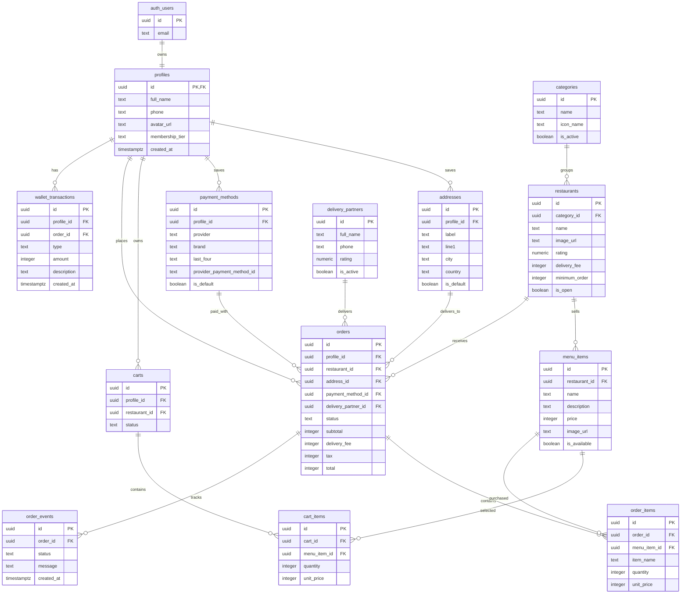

# Zivo Supabase Database Diagram

This is the simple version of the database for the Flutter food-delivery app.
Supabase Auth owns login accounts in `auth.users`; the app stores public user
data in `profiles`.

## Core Diagram

## Why This Is Kept Simple

- `profiles.id` is the same value as `auth.users.id`, so there is no duplicate
  auth table.
- Prices are stored as integers in the smallest currency unit, for example
  `350000` for NGN 3,500.00. This avoids floating point money bugs.
- `order_items.item_name` stores a snapshot so old orders still show the right
  dish name if a restaurant edits its menu later.
- Cards are not stored directly. `payment_methods` keeps only display metadata
  plus the payment provider's token/id.
- Order tracking is one flexible `order_events` table instead of many delivery
  tracking tables.

## Tables To Build First

1. `profiles`
2. `addresses`
3. `categories`
4. `restaurants`
5. `menu_items`
6. `carts`
7. `cart_items`
8. `orders`
9. `order_items`

Add `payment_methods`, `delivery_partners`, `order_events`, and
`wallet_transactions` after the basic ordering flow works.
