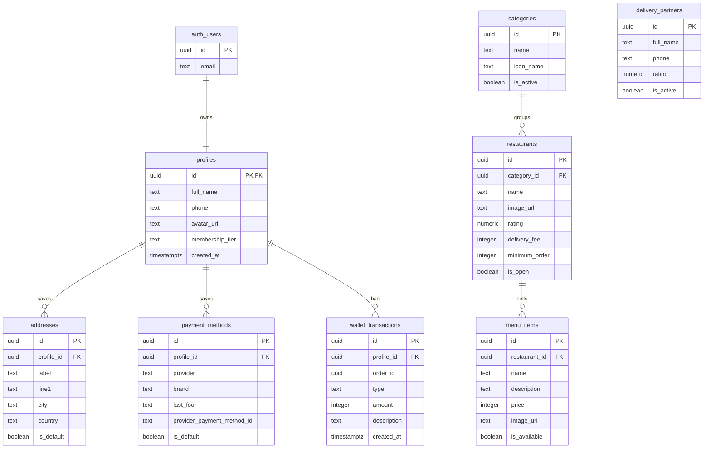

# Zivo Supabase Database Diagram

This diagram covers the shared base tables defined in `supabase/schema.sql`.
Supabase Auth owns login accounts in `auth.users`; the app stores public user
data in `profiles`.

**This is not the whole database.** Ordering lives in the per-vertical tables
created by `supabase/migrations/` — `food_orders`/`food_order_items`,
`grocery_orders`/`grocery_order_items`,
`pharmacy_orders`/`pharmacy_order_items`, plus the `customer_activity` view
that unions them for the activity feed. Those are written only by the
`place_food_order` / `place_grocery_order` / `place_pharmacy_order`
`SECURITY DEFINER` RPCs, which recompute every price server-side.

A generic `carts` / `cart_items` / `orders` / `order_items` / `order_events`
model used to be drawn here as well. It was never queried by any Dart code and
its insert policies trusted client-supplied prices, so it was removed in issue
#75 — see the header of `supabase/schema.sql`.

## Core Diagram

`delivery_partners` is drawn unconnected on purpose: nothing links a profile to
a courier yet. `wallet_transactions.order_id` is not a foreign key — the order
it names lives in whichever per-vertical order table the transaction relates
to.

## Why This Is Kept Simple

- `profiles.id` is the same value as `auth.users.id`, so there is no duplicate
  auth table.
- Prices in these base tables are stored as integers in the smallest currency
  unit, for example `350000` for NGN 3,500.00, which avoids floating point
  money bugs. Note the per-vertical order tables in `supabase/migrations/` use
  `numeric(12, 2)` instead — that inconsistency is tracked separately in issue
  #8, not resolved here.
- Cards are not stored directly. `payment_methods` keeps only display metadata
  plus the payment provider's token/id, and the token column is not readable
  by the client at all (column-level grants in `supabase/schema.sql`).
- The `*_order_items.item_name` columns store a snapshot so old orders still
  show the right item name if a menu or catalog is edited later.

## Write Paths

There are no client-writable order tables. Everything that creates an order
goes through a `SECURITY DEFINER` RPC that derives `profile_id` from
`auth.uid()` and recomputes prices from the database:

- `place_food_order`
- `place_grocery_order`
- `place_pharmacy_order`

`payment_methods`, `delivery_partners` and `wallet_transactions` are read-only
to clients (and `delivery_partners` is not readable at all). Adding a payment
method or crediting a wallet needs an equivalent RPC that does not exist yet —
do not open those up with a plain insert policy.
